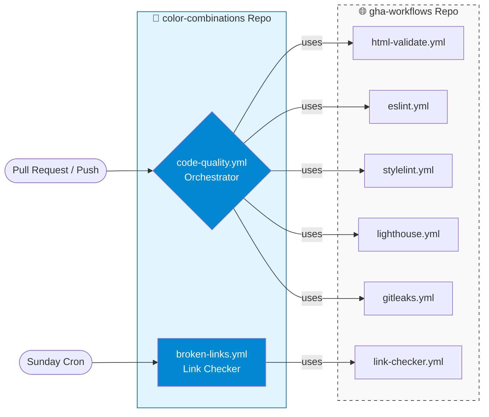

# Development & CI/CD Specification

> [!NOTE]
> **Project Status:** This repository is currently in active development. We are not accepting external contributions at this time while we finalize the core architecture and design systems.

This document serves as the technical blueprint for the **color-combinations** infrastructure. It outlines how we maintain high code standards through a modular, scalable CI/CD ecosystem.

## Case Study: Modular CI/CD Orchestration

### Executive Summary

The **color-combinations** repository serves as a reference implementation for a "Distributed CI/CD" architecture. By decoupling execution logic from project configuration, we achieve a high-velocity workflow that is both globally consistent and locally flexible.

### The Challenge

Traditional GitHub Actions setups often lead to "Workflow Drift," where CI scripts are copied and pasted across multiple repositories. This creates:

* **Maintenance Debt:** Updating a single linter rule requires manual changes in every repo.
* **Inconsistency:** Different projects eventually run slightly different versions of the same quality checks.
* **Configuration Bloat:** READMEs and project roots become cluttered with redundant YAML logic.

### The Solution: The Orchestrator Pattern

We implemented a hub-and-spoke model where the **logic** resides in a centralized library and the **orchestration** resides in the local project.

#### 1. Centralized Logic (`gha-workflows`)

Our "Source of Truth" repository houses atomic, reusable workflows. Each workflow (e.g., `eslint.yml`) is a black box that contains the environment setup, caching strategies, and execution commands for a single tool.

While we leverage high-quality marketplace actions (such as `actions/setup-node`), we maintain our own library to act as a **standardized abstraction layer**.

By wrapping common actions into our own reusable workflows, we achieve **governance and consistency** without having to build every utility from scratch.

**The benefits of our custom wrapper library approach include:**

* **Centralized Configuration:** Instead of defining the node version or linter flags in every repo, we define them once in `gha-workflows`. If we need to upgrade a version, we change it in one place, and every project (including **color-combinations**) inherits the update.
* **Streamlined Maintenance:** We can swap out an underlying marketplace action for a better one without ever touching the code in our individual project repositories.
* **Optimized Defaults:** We bake our specific "best practices"—like specialized caching or error reporting—directly into the reusable jobs, so they are "on by default" for every project.
* **Controlled Environment:** We ensure that every project uses the exact same tool versions, preventing "drift" where one repo uses ESLint 8 and another uses ESLint 9.

> #### ⚖️ A Note on Control vs. Dependency
> 
> 
> While we strive for high governance over our CI/CD, **"absolute control" is a pragmatic ideal rather than a literal reality.** Our reusable workflows are built on top of industry-standard GitHub Actions (like `actions/checkout` or `actions/setup-node`).
> We do not seek to reinvent these foundational utilities. Instead, our goal is to **own the configuration layer.** By wrapping these dependencies within our `gha-workflows` library, we ensure that:
> * **We vet the versions:** We decide when the entire organization moves to a new version of an action.
> * **We standardize the inputs:** We prevent "configuration drift" by ensuring every project uses the same optimized flags and environment settings.
> 
> 
> In this model, we trade the "myth" of absolute control for the reality of **centralized governance.**

#### 2. Project-Specific Orchestration (`code-quality.yml`)

In the **color-combinations** repo, we use a single entry point—the `code-quality` workflow—to call only the modules required for our stack.

| Module | Source | Role | Trigger |
| --- | --- | --- | --- |
| **Markup** | `html-validate` | Standardizes accessibility and semantic checks. | PR / Push |
| **Logic** | `eslint` | Enforces JavaScript/TypeScript best practices. | PR / Push |
| **Styles** | `stylelint` | Validates CSS/SCSS against design rules. | PR / Push |
| **Security** | `gitleaks` | Prevents secrets/API keys from entering history. | PR / Push |
| **Performance** | `lighthouse` | Audits Core Web Vitals and SEO metrics. | PR / Push |
| **Links** | `link-checker` | Validates all outgoing and internal URLs. | Sunday Cron |

### 🔒 Security & Performance as a Standard

> In this architecture, security and performance are not "afterthoughts" or manual checklists—they are automated constraints.
> * **Proactive Security (`gitleaks`):** By integrating secret scanning into the orchestrator, we protect the project’s integrity before a single line of code is merged. This ensures that sensitive data never enters the git history, adhering to the principle of "Security by Design."
> * **Quantifiable Quality (`lighthouse`):** Performance is a core feature of the **color-combinations** gallery. Using Lighthouse in our CI allows us to treat performance budgets as failing tests; if a change degrades the user experience or SEO, the build fails.
### Strategic Maintenance (The "Sunday Scan")

While code quality and security checks are triggered by every push, we utilize a separate **scheduled synchronization** for environment health. Every **Sunday at 22:00 UTC**, a dedicated workflow checks the integrity of the project's external connections.

**Why Sunday?**

* **External Integrity:** Link rot (broken external URLs) happens independently of our code changes.
* **Clean Start:** Catching broken resources on Sunday ensures the gallery is fully functional for users and developers at the start of the week.

### Results

* **Zero Logic Duplication:** 100% of the linting logic is imported, not written locally.
* **Instant Updates:** A change to the central `eslint` config is inherited by this project automatically.
* **Scalability:** Adding a new language (e.g., Python) to a different project would require zero changes to the core architecture of this repository.
